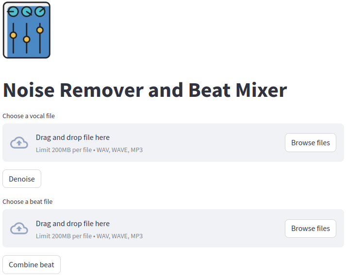

# Noise Remover and Beat Mixer
<div align="center">

</div>

## Overview
This application includes a noise remover which uses [CleanUNet](https://research.nvidia.com/labs/adlr/projects/cleanunet/) as its denoising model; and a beat mixer which allows users to add background music to their audio.

## Built With
<div align="center">
<a href="https://streamlit.io/">
  
</a>
<a href="https://librosa.org/">
  
</a>
<a href="https://pytorch.org/">
  
</a>
</div>

## Usage
1. Clone the repo
   ```sh
   git clone https://github.com/hieunm44/noise-remover-beat-mixer.git
   cd noise-remover-beat-mixer
   ```
2. Install necessary packages
   ```sh
   pip install -r requirements.txt
   ```
3. Go to https://github.com/NVIDIA/CleanUNet and download pretrained models located in the folder `exp`, then put them into your local folder `exp`.
4. Run the app
   ```sh
   streamlit run app.py
   ```